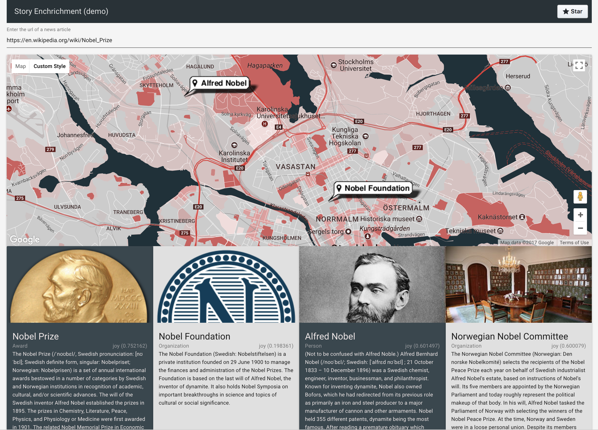

# watson-nlu-dbpedia-app

A sample application that uses Watson Natural Language Understanding, DBpedia, and IBM Cloud Functions (OpenWhisk). 
<div align="center" style="text-align: center;">


</div>
<br>

The client application is implemented with Vue.js. The UI enables a user to enter a url, preferably one that references a news article. The UI invokes a backend that analyzes the article's contents, identifies a subset of relevant entities, then looks up their details using DBpedia. Finally, the results are rendered as cards. Entities with locations will appear on a Google Map.

The backend is implemented using IBM Cloud Functions.

<p align="center">

</p>

## Try it out
To see the live workkng demo, navigate to [https://nlu-web.mybluemix.net](https://nlu-web.mybluemix.net)

## Prerequisities
- Required [IBM Cloud account](https://www.bluemix.net). Lite / Free tier is sufficient.

- A [Watson Natural Language Understanding](https://console.bluemix.net/catalog/services/natural-language-understanding) service instance on IBM Cloud.

## Setup

### Server

1. Login and set your target organization and space

	```shell
	bx login
	bx target -o <YOUR-ORGANIZATION> -s <YOUR-SPACE>
	```

2. Apply your Watson Natural Language Understanding service credentials

	```
	vi server/index.js
	```
	Note: `:wq!` will save an exit from `vi`
	
3. Replace line `<YOUR-USERNAME>` and `<YOUR-PASSWORD>` with your service credentials

	```javascript
	const nlu = new NaturalLanguageUnderstandingV1({
	  username: '<YOUR-USERNAME>',
	  password: '<YOUR-PASSWORD>',
	  version_date: '2017-02-27',
	})
	```

4. Deploy the OpenWhisk action (IBM Cloud Function)

	```shell
	 bx wsk action update /<YOUR-ORGANIZATION>_<YOUR-SPACE>/demo/nlu_analyze index.js --web true --kind nodejs:8
	```

### Client

1. Change the endpoint url to reference your new action's endpoint

	```shell
	vi src/config.js
	```
	
	```javascript
	export const nluNewsApiRoot = 'https://openwhisk.ng.bluemix.net/api/v1/web/<YOUR-ORGANIZATION>_<YOUR-SPACE>/demo'
	```

2. Install dependencies

```shell
npm install
```

## Run (locally)
1. Install dependencies

	```shell
	npm start
	```

2. Navigate to [http://localhost:8080](http://localhost:8080)

## Deploy (IBM Cloud)
1. Open `./manifest.yml` and update `name` and `host` with `<YOUR-USERNAME>-nlu-web`

2. Build for production

	```shell
	npm run build
	```

3. Deploy

	```shell
	cf push
	```

4. Navigate to [https://YOUR-USERNAME.mybluemix.net](https://YOUR-USERNAME.mybluemix.net)

## License
MIT

